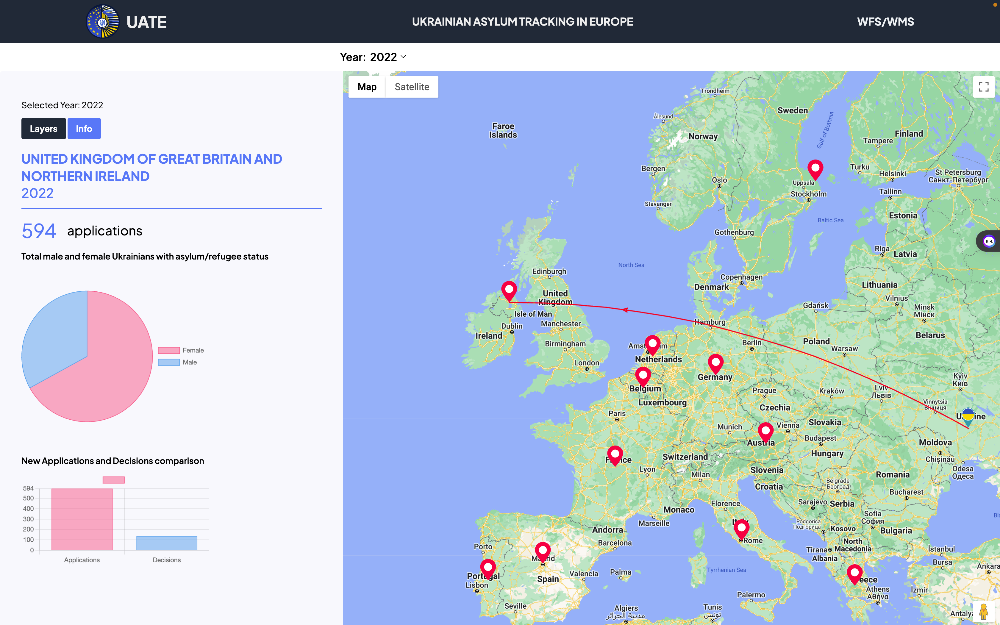
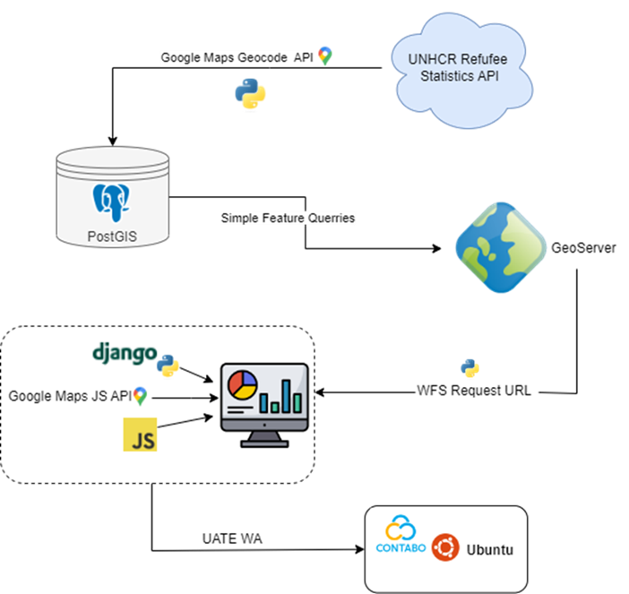

# UATE — Ukrainian Asylum Tracking in Europe

**A Spatial Data Infrastructure for exploring Ukrainian asylum applications, decisions, and demographic patterns across Europe**

UATE is an academic geospatial project developed to retrieve, process, manage, and visualize asylum-related data for Ukrainian nationals across selected European countries.

The project integrates data from the **UNHCR Refugee Statistics API** with geospatial technologies to examine asylum applications, asylum decisions, and demographic characteristics over the period **2013–2022**.

The original implementation was developed as part of the **IP – Spatial Data Infrastructure (SDI) Services Implementation** course within the MSc Applied Geoinformatics programme at the University of Salzburg.

## Original Interactive Dashboard



The original UATE dashboard combined an interactive European map with asylum application statistics, demographic information, asylum-decision comparisons, and origin–destination visualization. Users could explore annual patterns and interact with destination countries to examine country-level information.

> **Note:** The original academic deployment is no longer publicly available. The screenshot above documents the completed implementation, while a reconstructed portfolio version is planned.

---

## Project Objectives

The project was designed to:

- retrieve asylum and demographic data dynamically from the UNHCR API;
- geocode countries of asylum for spatial visualization;
- store and manage spatial data using PostgreSQL/PostGIS;
- publish geospatial information through GeoServer using WMS/WFS services;
- integrate spatial services into a Django-based web application;
- visualize migration patterns through interactive maps and charts.

---

## SDI Architecture

The original system followed an end-to-end geospatial data workflow:

**UNHCR Refugee Statistics API → Python → Google Geocoding API → PostgreSQL/PostGIS → GeoServer → Django → Interactive Web Dashboard**
### System Architecture



*Original UATE system architecture showing the integration of the UNHCR Refugee Statistics API, Python processing, Google Geocoding API, PostGIS, GeoServer services, Django, JavaScript, and the cloud-hosted web application.*

### Data Layer
UNHCR API data covering Ukrainian asylum applications, asylum decisions, and demographic characteristics.

### Processing Layer
Python scripts were used for API retrieval, transformation, demographic aggregation, geocoding, and database ingestion.

### Spatial Database
Processed records were stored in **PostgreSQL/PostGIS**, including geographic point geometries representing countries of asylum.

### Geospatial Services
**GeoServer** was used to expose spatial database content through OGC web services including **WMS** and **WFS**.

### Application Layer
A **Django** web application integrated the geospatial services with interactive mapping and visualization components.

---

## Core Analyses

### Asylum Applications
Annual asylum applications from Ukrainian nationals across selected European destination countries were retrieved and spatially represented.

### Asylum Decisions
Decision records were processed to examine recognized, rejected, closed, and other asylum decision outcomes.

### Demographic Patterns
Age- and sex-disaggregated UNHCR demographic information was processed to support comparison of refugee population characteristics across destination countries.

### Migration Visualization
Interactive mapping connected Ukraine with destination countries and provided country-level information through map interaction.

---

## Technology Stack

- Python
- PostgreSQL
- PostGIS
- GeoServer
- Django
- JavaScript
- Google Maps JavaScript API
- Google Geocoding API
- Chart.js
- UNHCR Refugee Statistics API
- WMS / WFS
- HTML / CSS

---

## Repository Structure

```text
UATE-Ukrainian-Asylum-Tracking-Europe/
│
├── code/          # Python processing and web-mapping code
├── assets/        # Project screenshots and visual documentation
├── metadata/      # Geospatial metadata records
├── docs/          # Academic project documentation
└── README.md
```

---

---

## Dashboard

The original UATE dashboard was developed as part of the academic SDI implementation and integrated asylum applications, asylum decisions, demographic information, interactive mapping, and statistical visualization.

The original deployment is no longer publicly available. A reconstructed portfolio version is planned using the preserved project code, data workflow, documentation, and original implementation as reference.

---

## Data Source

Primary asylum and demographic information was retrieved from the **UNHCR Refugee Statistics API**.

The project focused on Ukrainian nationals across selected European countries over the period **2013–2022**.

---

## Academic Context

**Project:** Ukrainian Migration and Asylum Tracking in Europe  
**Programme:** MSc Applied Geoinformatics  
**Institution:** University of Salzburg, Austria  
**Course:** IP – Spatial Data Infrastructure (SDI) Services Implementation  
**Academic Term:** Winter Term 2023/24

---

## Documentation

Detailed project documentation covering the SDI architecture, methodology, data processing workflow, database implementation, geospatial services, and original dashboard will be provided in the `docs/` directory.

---

## Project Status

**Original academic implementation:** Completed  
**GitHub portfolio organization:** Completed  
**Interactive dashboard reconstruction:** Planned
